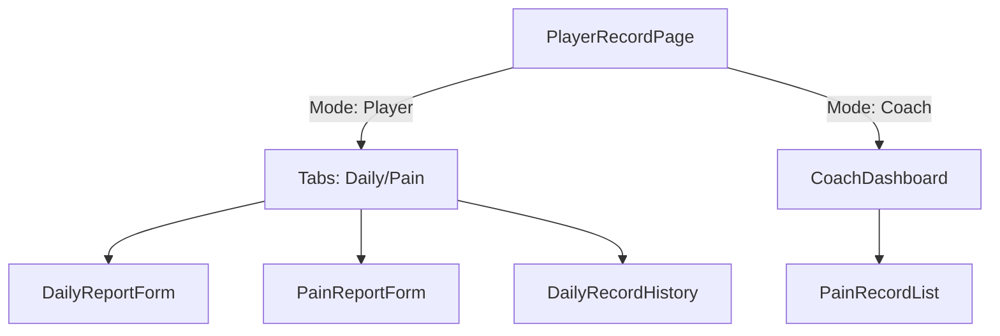

# 20260113-疼痛回報功能實作計畫

> **日期**: 2026-01-13
> **主題**: 疼痛回報功能開發 (Pain Reporting)
> **目標**: 允許球員回報身體疼痛狀況，並讓教練追蹤傷病歷史。

---

## 1. 功能需求

### 球員端
- **疼痛回報表單**:
    - **身體部位**: 選擇 (如：肩膀、手肘、膝蓋、下背...)
    - **疼痛程度**: 1-10 分 (VAS 量表)
    - **疼痛類型**: 急性 (Acute) / 慢性 (Chronic) / 疲勞 (Fatigue)
    - **描述**: 文字補充
- **紀錄檢視**: 
    - 查看自己的未解決/已解決疼痛紀錄

### 教練端
- **傷病監控**:
    - 在球員資訊頁面查看疼痛紀錄
    - 標示高風險部位

---

## 2. 系統架構設計

### 資料庫 Schema (已存在)

Table: `sport.pain_reports`
- `player_id`: UUID
- `body_part`: VARCHAR
- `pain_level`: INTEGER (1-10)
- `pain_type`: VARCHAR
- `is_resolved`: BOOLEAN (預設 false)
- `description`: TEXT

### 前端元件架構



---

## 3. 實作細節

### A. 資料存取層 (`hooks/usePlayer.ts`)

新增以下 Hooks:

```typescript
// 提交疼痛回報
export function useSubmitPainReport() {
    // INSERT into sport.pain_reports
}

// 取得疼痛紀錄
export function usePlayerPainReports(playerId: string) {
    // SELECT * FROM sport.pain_reports WHERE player_id = ...
}
```

### B. UI 元件

#### 1. `PainReportForm.tsx`
- 使用 `Select` 或簡單的 Button Group 選擇身體部位
- 使用 `Slider` 選擇疼痛分數 (顏色隨分數變化: 綠->黃->紅)
- 提交後顯示成功訊息

#### 2. `PainRecordList.tsx`
- 表格或卡片式顯示
- 欄位：日期、部位、程度 (Badge)、狀態

### C. 頁面整合 (`PlayerRecordPage.tsx`)

- 在球員模式下，使用 `Tabs` 分隔「每日回報」與「疼痛回報」。
- 或是將疼痛回報作為每日回報的一個選填區塊？(目前計畫分開，因為疼痛不是每天都有)

---

## 4. 實作步驟

1.  **Hooks 開發**: 修改 `src/hooks/usePlayer.ts`
2.  **表單元件**: 建立 `src/components/player/PainReportForm.tsx`
3.  **列表元件**: 建立 `src/components/records/PainRecordList.tsx`
4.  **頁面整合**: 修改 `src/pages/shared/PlayerRecordPage.tsx`
5.  **測試**: 手動驗證流程

---

## 5. 驗證項目

- [ ] 球員登入後可看到疼痛回報選項
- [ ] 提交疼痛回報資料正確寫入 DB
- [ ] 列表能正確顯示未解決的疼痛
