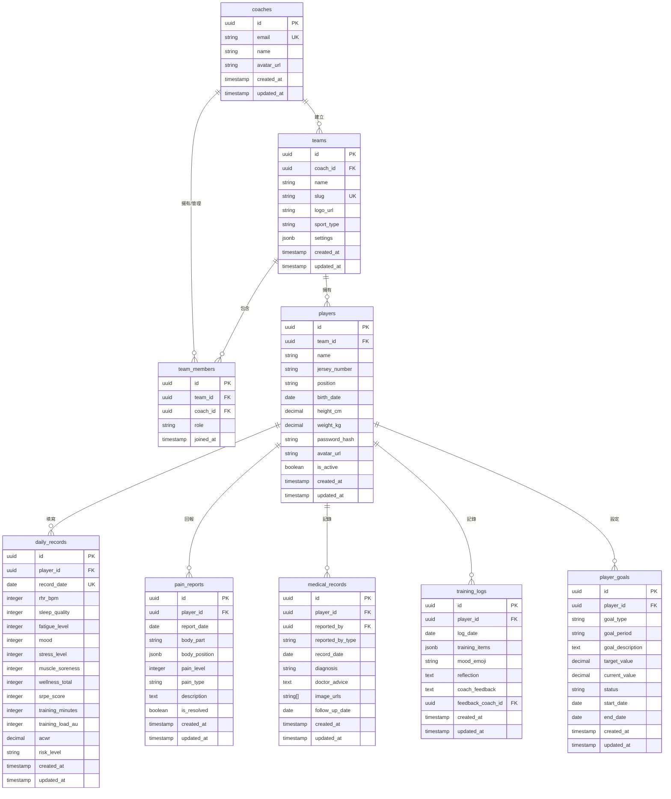
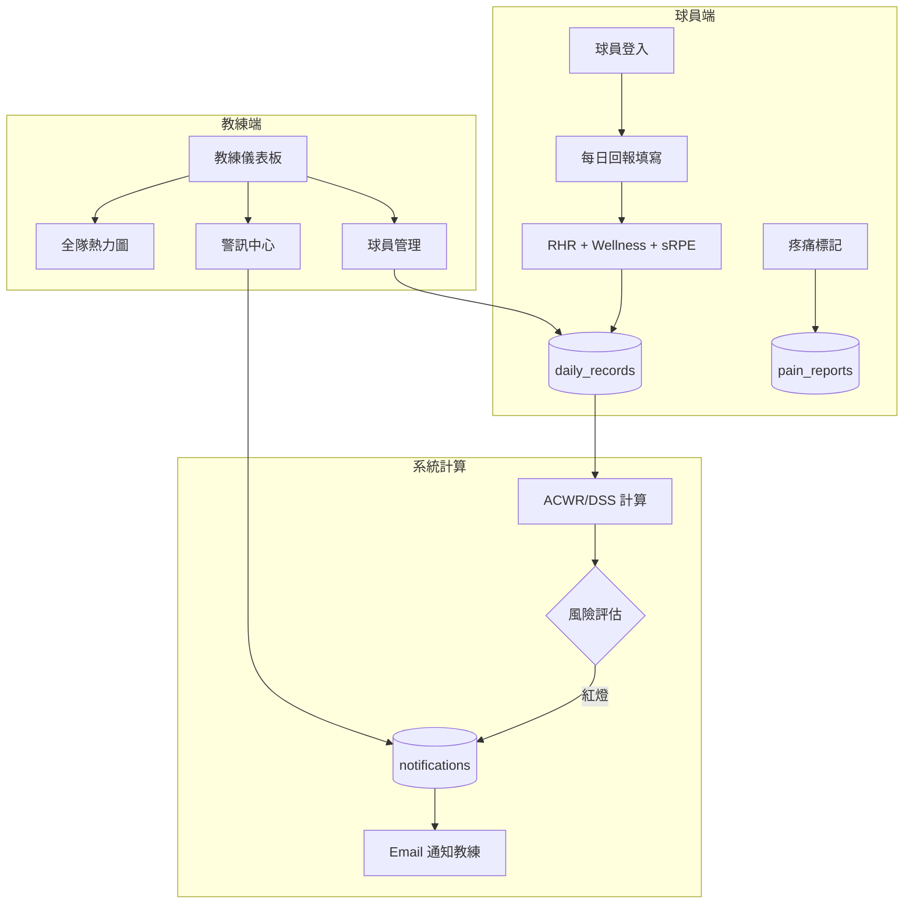

# 基層運動訓練系統 - Database Schema 設計書

> 文件版號：V1.0  
> 日期：2026-01-11  
> Schema 名稱：`sport`  
> 資料庫：Supabase (PostgreSQL)

---

## 1. 系統概述

本系統為基層運動球隊提供訓練疲勞管理、傷病回報、訓練日誌、訓練計畫與目標管理等功能。資料庫設計需支援：

- **多球隊管理**：一個教練可管理多支球隊
- **雙端存取**：教練端與球員端共享核心資料
- **科學監控**：支援 ACWR、RHR、Wellness、sRPE 等運動科學指標計算
- **安全隔離**：透過 RLS 確保資料存取權限

---

## 2. ERD 實體關聯圖



---

## 3. 表格定義

### 3.1 `coaches` - 教練資料表

| 欄位 | 類型 | 必填 | 預設值 | 說明 |
|------|------|------|--------|------|
| `id` | UUID | ✅ | `gen_random_uuid()` | 主鍵 |
| `email` | VARCHAR(255) | ✅ | - | Email（唯一，關聯 Supabase Auth） |
| `name` | VARCHAR(100) | ✅ | - | 教練姓名 |
| `avatar_url` | TEXT | ❌ | NULL | 大頭貼 URL |
| `created_at` | TIMESTAMPTZ | ✅ | `NOW()` | 建立時間 |
| `updated_at` | TIMESTAMPTZ | ✅ | `NOW()` | 更新時間 |

**索引**：
- `idx_coaches_email` on `email` (UNIQUE)

---

### 3.2 `teams` - 球隊資料表

| 欄位 | 類型 | 必填 | 預設值 | 說明 |
|------|------|------|--------|------|
| `id` | UUID | ✅ | `gen_random_uuid()` | 主鍵 |
| `coach_id` | UUID | ✅ | - | 建立者教練 ID (FK → coaches.id) |
| `name` | VARCHAR(100) | ✅ | - | 球隊中文名稱 |
| `slug` | VARCHAR(50) | ✅ | - | 球隊英文代碼（URL 用，唯一） |
| `logo_url` | TEXT | ❌ | NULL | 隊徽 URL |
| `sport_type` | VARCHAR(50) | ✅ | `'baseball'` | 運動項目 |
| `settings` | JSONB | ❌ | `'{}'` | 球隊設定（通知偏好等） |
| `created_at` | TIMESTAMPTZ | ✅ | `NOW()` | 建立時間 |
| `updated_at` | TIMESTAMPTZ | ✅ | `NOW()` | 更新時間 |

**索引**：
- `idx_teams_slug` on `slug` (UNIQUE)
- `idx_teams_coach_id` on `coach_id`

---

### 3.3 `team_members` - 球隊成員表（多教練支援）

| 欄位 | 類型 | 必填 | 預設值 | 說明 |
|------|------|------|--------|------|
| `id` | UUID | ✅ | `gen_random_uuid()` | 主鍵 |
| `team_id` | UUID | ✅ | - | 球隊 ID (FK → teams.id) |
| `coach_id` | UUID | ✅ | - | 教練 ID (FK → coaches.id) |
| `role` | VARCHAR(20) | ✅ | `'member'` | 角色：`owner`, `admin`, `member` |
| `joined_at` | TIMESTAMPTZ | ✅ | `NOW()` | 加入時間 |

**索引**：
- `idx_team_members_team_coach` on `(team_id, coach_id)` (UNIQUE)

---

### 3.4 `players` - 球員資料表

| 欄位 | 類型 | 必填 | 預設值 | 說明 |
|------|------|------|--------|------|
| `id` | UUID | ✅ | `gen_random_uuid()` | 主鍵（即球員 URL ID） |
| `team_id` | UUID | ✅ | - | 所屬球隊 ID (FK → teams.id) |
| `name` | VARCHAR(100) | ✅ | - | 球員姓名 |
| `jersey_number` | VARCHAR(10) | ❌ | NULL | 背號 |
| `position` | VARCHAR(50) | ❌ | NULL | 守備位置 |
| `birth_date` | DATE | ❌ | NULL | 出生日期 |
| `height_cm` | DECIMAL(5,1) | ❌ | NULL | 身高（公分） |
| `weight_kg` | DECIMAL(5,1) | ❌ | NULL | 體重（公斤） |
| `password_hash` | VARCHAR(255) | ✅ | - | 登入密碼雜湊 |
| `avatar_url` | TEXT | ❌ | NULL | 大頭貼 URL |
| `is_active` | BOOLEAN | ✅ | `TRUE` | 是否在隊 |
| `created_at` | TIMESTAMPTZ | ✅ | `NOW()` | 建立時間 |
| `updated_at` | TIMESTAMPTZ | ✅ | `NOW()` | 更新時間 |

**索引**：
- `idx_players_team_id` on `team_id`
- `idx_players_team_jersey` on `(team_id, jersey_number)` (UNIQUE where jersey_number IS NOT NULL)

---

### 3.5 `daily_records` - 每日訓練紀錄表

| 欄位 | 類型 | 必填 | 預設值 | 說明 |
|------|------|------|--------|------|
| `id` | UUID | ✅ | `gen_random_uuid()` | 主鍵 |
| `player_id` | UUID | ✅ | - | 球員 ID (FK → players.id) |
| `record_date` | DATE | ✅ | - | 紀錄日期 |
| `rhr_bpm` | INTEGER | ❌ | NULL | 晨間靜止心率 (bpm) |
| `sleep_quality` | INTEGER | ❌ | NULL | 睡眠品質 (1-5) |
| `fatigue_level` | INTEGER | ❌ | NULL | 疲勞程度 (1-5) |
| `mood` | INTEGER | ❌ | NULL | 心情 (1-5) |
| `stress_level` | INTEGER | ❌ | NULL | 壓力水準 (1-5) |
| `muscle_soreness` | INTEGER | ❌ | NULL | 肌肉痠痛 (1-5) |
| `wellness_total` | INTEGER | ❌ | NULL | Wellness 總分 (計算欄位，5-25) |
| `srpe_score` | INTEGER | ❌ | NULL | sRPE 分數 (0-10) |
| `training_minutes` | INTEGER | ❌ | NULL | 訓練時長（分鐘） |
| `training_load_au` | INTEGER | ❌ | NULL | 訓練負荷 AU (RPE × 分鐘) |
| `acwr` | DECIMAL(4,2) | ❌ | NULL | 當日 ACWR 指數 |
| `risk_level` | VARCHAR(20) | ❌ | NULL | 風險等級：`green`, `yellow`, `red`, `black` |
| `created_at` | TIMESTAMPTZ | ✅ | `NOW()` | 建立時間 |
| `updated_at` | TIMESTAMPTZ | ✅ | `NOW()` | 更新時間 |

**索引**：
- `idx_daily_records_player_date` on `(player_id, record_date)` (UNIQUE)
- `idx_daily_records_date` on `record_date`
- `idx_daily_records_risk` on `risk_level`

**約束**：
- `chk_wellness_range`: 各 Wellness 欄位值介於 1-5
- `chk_srpe_range`: `srpe_score` 介於 0-10

---

### 3.6 `pain_reports` - 疼痛回報表

| 欄位 | 類型 | 必填 | 預設值 | 說明 |
|------|------|------|--------|------|
| `id` | UUID | ✅ | `gen_random_uuid()` | 主鍵 |
| `player_id` | UUID | ✅ | - | 球員 ID (FK → players.id) |
| `report_date` | DATE | ✅ | `CURRENT_DATE` | 回報日期 |
| `body_part` | VARCHAR(50) | ✅ | - | 疼痛部位（如：left_shoulder） |
| `body_position` | JSONB | ❌ | NULL | 人體圖標記座標 |
| `pain_level` | INTEGER | ✅ | - | 疼痛程度 (1-10) |
| `pain_type` | VARCHAR(50) | ❌ | NULL | 疼痛類型：`acute`, `chronic`, `fatigue` |
| `description` | TEXT | ❌ | NULL | 詳細描述 |
| `is_resolved` | BOOLEAN | ✅ | `FALSE` | 是否已解決 |
| `created_at` | TIMESTAMPTZ | ✅ | `NOW()` | 建立時間 |
| `updated_at` | TIMESTAMPTZ | ✅ | `NOW()` | 更新時間 |

**索引**：
- `idx_pain_reports_player_id` on `player_id`
- `idx_pain_reports_unresolved` on `player_id` WHERE `is_resolved = FALSE`

---

### 3.7 `medical_records` - 醫療紀錄表

| 欄位 | 類型 | 必填 | 預設值 | 說明 |
|------|------|------|--------|------|
| `id` | UUID | ✅ | `gen_random_uuid()` | 主鍵 |
| `player_id` | UUID | ✅ | - | 球員 ID (FK → players.id) |
| `reported_by` | UUID | ✅ | - | 填寫者 ID |
| `reported_by_type` | VARCHAR(20) | ✅ | - | 填寫者類型：`coach`, `player` |
| `record_date` | DATE | ✅ | `CURRENT_DATE` | 紀錄日期 |
| `diagnosis` | VARCHAR(255) | ❌ | NULL | 診斷結果 |
| `doctor_advice` | TEXT | ❌ | NULL | 醫生建議 |
| `image_urls` | TEXT[] | ❌ | NULL | 診斷照片 URL 陣列 |
| `follow_up_date` | DATE | ❌ | NULL | 回診日期 |
| `created_at` | TIMESTAMPTZ | ✅ | `NOW()` | 建立時間 |
| `updated_at` | TIMESTAMPTZ | ✅ | `NOW()` | 更新時間 |

**索引**：
- `idx_medical_records_player_id` on `player_id`
- `idx_medical_records_date` on `record_date`

---

### 3.8 `training_logs` - 訓練日誌表 (P2)

| 欄位 | 類型 | 必填 | 預設值 | 說明 |
|------|------|------|--------|------|
| `id` | UUID | ✅ | `gen_random_uuid()` | 主鍵 |
| `player_id` | UUID | ✅ | - | 球員 ID (FK → players.id) |
| `log_date` | DATE | ✅ | - | 日誌日期 |
| `training_items` | JSONB | ❌ | `'[]'` | 訓練項目（Icon 代碼陣列） |
| `mood_emoji` | VARCHAR(10) | ❌ | NULL | 心情 Emoji |
| `reflection` | TEXT | ❌ | NULL | 心得與反思 |
| `coach_feedback` | TEXT | ❌ | NULL | 教練回饋 |
| `feedback_coach_id` | UUID | ❌ | NULL | 回饋教練 ID (FK → coaches.id) |
| `created_at` | TIMESTAMPTZ | ✅ | `NOW()` | 建立時間 |
| `updated_at` | TIMESTAMPTZ | ✅ | `NOW()` | 更新時間 |

**索引**：
- `idx_training_logs_player_date` on `(player_id, log_date)` (UNIQUE)

---

### 3.9 `player_goals` - 目標管理表 (P2)

| 欄位 | 類型 | 必填 | 預設值 | 說明 |
|------|------|------|--------|------|
| `id` | UUID | ✅ | `gen_random_uuid()` | 主鍵 |
| `player_id` | UUID | ✅ | - | 球員 ID (FK → players.id) |
| `goal_type` | VARCHAR(50) | ✅ | - | 目標類型：`skill`, `fitness`, `performance` |
| `goal_period` | VARCHAR(20) | ✅ | - | 週期：`monthly`, `quarterly`, `yearly` |
| `goal_description` | TEXT | ✅ | - | 目標描述 |
| `target_value` | DECIMAL(10,2) | ❌ | NULL | 目標數值（如球速 140km/h） |
| `current_value` | DECIMAL(10,2) | ❌ | NULL | 當前數值 |
| `status` | VARCHAR(20) | ✅ | `'active'` | 狀態：`active`, `completed`, `cancelled` |
| `start_date` | DATE | ✅ | - | 開始日期 |
| `end_date` | DATE | ✅ | - | 結束日期 |
| `created_at` | TIMESTAMPTZ | ✅ | `NOW()` | 建立時間 |
| `updated_at` | TIMESTAMPTZ | ✅ | `NOW()` | 更新時間 |

**索引**：
- `idx_player_goals_player_id` on `player_id`
- `idx_player_goals_status` on `status`

---

### 3.10 `notifications` - 通知紀錄表

| 欄位 | 類型 | 必填 | 預設值 | 說明 |
|------|------|------|--------|------|
| `id` | UUID | ✅ | `gen_random_uuid()` | 主鍵 |
| `team_id` | UUID | ✅ | - | 球隊 ID (FK → teams.id) |
| `player_id` | UUID | ❌ | NULL | 相關球員 ID (FK → players.id) |
| `type` | VARCHAR(50) | ✅ | - | 通知類型：`risk_alert`, `pain_report`, `medical_update` |
| `title` | VARCHAR(255) | ✅ | - | 通知標題 |
| `message` | TEXT | ✅ | - | 通知內容 |
| `is_read` | BOOLEAN | ✅ | `FALSE` | 是否已讀 |
| `created_at` | TIMESTAMPTZ | ✅ | `NOW()` | 建立時間 |

**索引**：
- `idx_notifications_team_id` on `team_id`
- `idx_notifications_unread` on `team_id` WHERE `is_read = FALSE`

---

## 4. 輔助函數與觸發器

### 4.1 更新時間戳觸發器

```sql
-- 通用更新時間戳函數
CREATE OR REPLACE FUNCTION sport.update_updated_at()
RETURNS TRIGGER AS $$
BEGIN
  NEW.updated_at = NOW();
  RETURN NEW;
END;
$$ LANGUAGE plpgsql;
```

### 4.2 Wellness 總分自動計算

```sql
-- 自動計算 Wellness 總分
CREATE OR REPLACE FUNCTION sport.calculate_wellness_total()
RETURNS TRIGGER AS $$
BEGIN
  NEW.wellness_total = COALESCE(NEW.sleep_quality, 0) 
                     + COALESCE(NEW.fatigue_level, 0) 
                     + COALESCE(NEW.mood, 0) 
                     + COALESCE(NEW.stress_level, 0) 
                     + COALESCE(NEW.muscle_soreness, 0);
  RETURN NEW;
END;
$$ LANGUAGE plpgsql;
```

### 4.3 訓練負荷 AU 自動計算

```sql
-- 自動計算訓練負荷 AU
CREATE OR REPLACE FUNCTION sport.calculate_training_load()
RETURNS TRIGGER AS $$
BEGIN
  IF NEW.srpe_score IS NOT NULL AND NEW.training_minutes IS NOT NULL THEN
    NEW.training_load_au = NEW.srpe_score * NEW.training_minutes;
  END IF;
  RETURN NEW;
END;
$$ LANGUAGE plpgsql;
```

### 4.4 高風險預警通知觸發器

```sql
-- 當 risk_level 為 red 或 black 時，自動建立通知
CREATE OR REPLACE FUNCTION sport.create_risk_notification()
RETURNS TRIGGER AS $$
DECLARE
  v_player_name VARCHAR;
  v_team_id UUID;
BEGIN
  IF NEW.risk_level IN ('red', 'black') AND 
     (OLD.risk_level IS NULL OR OLD.risk_level NOT IN ('red', 'black')) THEN
    
    SELECT p.name, p.team_id INTO v_player_name, v_team_id
    FROM sport.players p WHERE p.id = NEW.player_id;
    
    INSERT INTO sport.notifications (team_id, player_id, type, title, message)
    VALUES (
      v_team_id,
      NEW.player_id,
      'risk_alert',
      '⚠️ 高風險警報',
      format('%s 的訓練負荷達到 %s 級風險，ACWR: %s，建議立即關注！', 
             v_player_name, 
             UPPER(NEW.risk_level), 
             COALESCE(NEW.acwr::TEXT, 'N/A'))
    );
  END IF;
  RETURN NEW;
END;
$$ LANGUAGE plpgsql;
```

---

## 5. RLS 安全政策

### 5.1 基本原則

- **教練**：只能存取自己管理的球隊資料
- **球員**：只能存取自己的個人資料
- **Service Role**：Edge Function 使用，可存取所有資料

### 5.2 RLS 政策範例

```sql
-- 啟用所有表的 RLS
ALTER TABLE sport.teams ENABLE ROW LEVEL SECURITY;
ALTER TABLE sport.players ENABLE ROW LEVEL SECURITY;
ALTER TABLE sport.daily_records ENABLE ROW LEVEL SECURITY;
-- ... 其他表

-- 教練存取球隊
CREATE POLICY "coaches_access_own_teams" ON sport.teams
FOR ALL TO authenticated
USING (
  id IN (
    SELECT team_id FROM sport.team_members
    WHERE coach_id = (
      SELECT id FROM sport.coaches WHERE email = auth.jwt() ->> 'email'
    )
  )
);

-- 教練存取球員
CREATE POLICY "coaches_access_team_players" ON sport.players
FOR ALL TO authenticated
USING (
  team_id IN (
    SELECT team_id FROM sport.team_members
    WHERE coach_id = (
      SELECT id FROM sport.coaches WHERE email = auth.jwt() ->> 'email'
    )
  )
);

-- 教練存取每日紀錄
CREATE POLICY "coaches_access_daily_records" ON sport.daily_records
FOR ALL TO authenticated
USING (
  player_id IN (
    SELECT p.id FROM sport.players p
    JOIN sport.team_members tm ON p.team_id = tm.team_id
    WHERE tm.coach_id = (
      SELECT id FROM sport.coaches WHERE email = auth.jwt() ->> 'email'
    )
  )
);
```

---

## 6. 資料流向圖



---

## 7. 未來擴展

### 7.1 Phase 2 新增表格

- `training_plans` - 訓練計畫表
- `skill_metrics` - 技術數據表（球速、揮棒速度等）

### 7.2 Phase 3 AI 整合

- `ai_recommendations` - AI 建議紀錄表
- `ai_analysis_logs` - AI 分析日誌表

---

## 8. 注意事項

> [!IMPORTANT]
> - 所有表格必須在 `sport` Schema 下建立，不使用 `public`
> - 禁止使用 `.single()` 查詢，一律使用 `.maybeSingle()`
> - Schema 名稱必須透過變數傳遞，禁止寫死

> [!WARNING]
> - 球員密碼必須使用 bcrypt 雜湊儲存
> - Email 發送由 Edge Function 處理，避免在 PostgreSQL 中處理中文編碼
